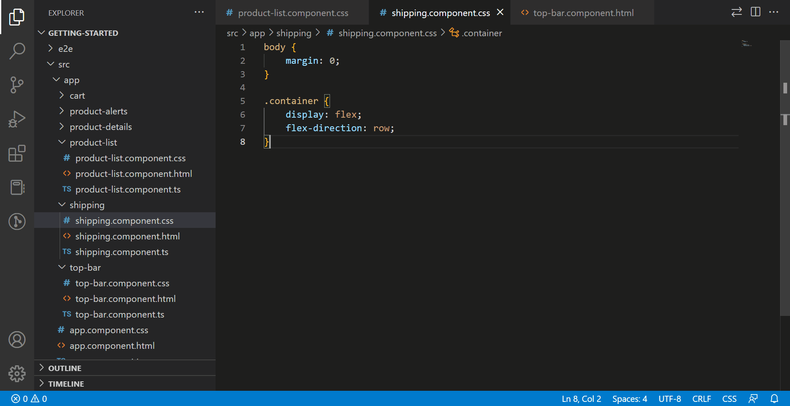
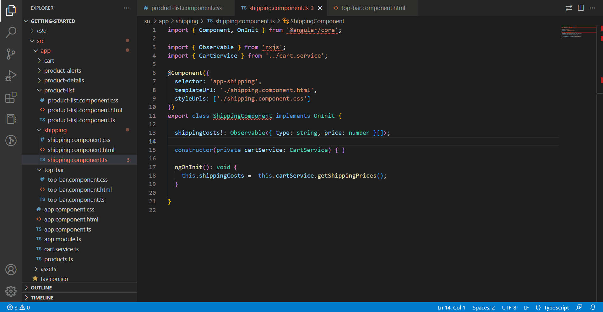

# angular-navigator README

With this extension you can switch rapidly between the files belonging to an angular component. Press `ctrl + shift + q` to close the active file and open an other. This way you will only have one open tab for every angular component you are working on.
## Features

Switching using the `ctrl + shift + q` keybinding

 

Switching using the button

## Requirements
Your angular component files should be in the same folder. They have the same name followed by .components. and then the extension.
For example:
* login.component.ts
* login.component.html
* login.component.spec.ts
* login.component.css
## Extension Settings

This extension contributes the following command:

* `angular-navigator.switchTo`: Opens a dialog where you can switch to an other file belonging to the same component.

This extension contributes the following keybinding:

* `ctrl + shift + q` to activate switchTo command

This extension contributes the following setting:

* `angular-navigator.enableButton`: Enable/disable Angular Navigator button on editor toolbar.

<!-- ## Known Issues

Calling out known issues can help limit users opening duplicate issues against your extension. -->

## Release Notes
### 1.0.0

Initial release of angular-navigator.

### 1.0.1

Changed keybinding and updated readme.

<!-- ### 1.0.1

Fixed issue #.

### 1.1.0

Added features X, Y, and Z. -->
